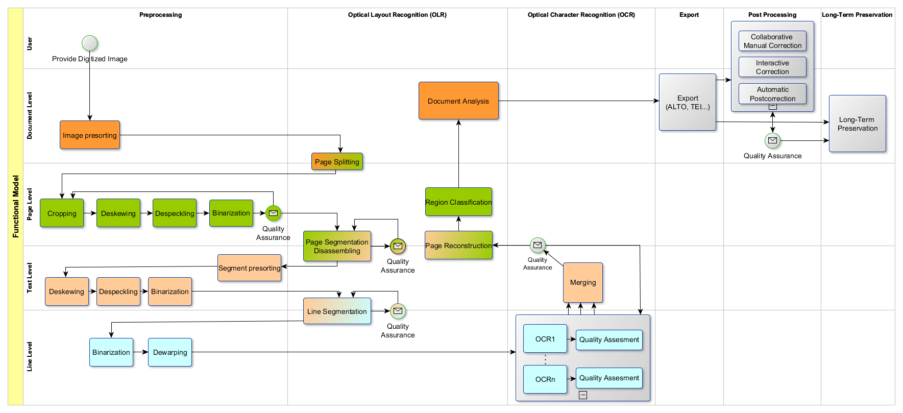
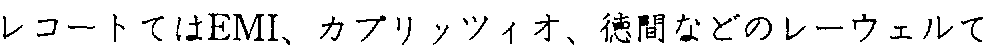
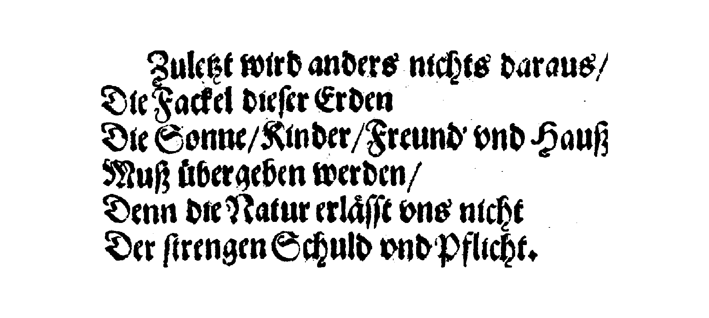
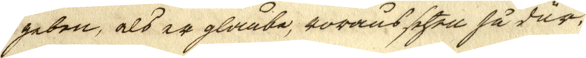
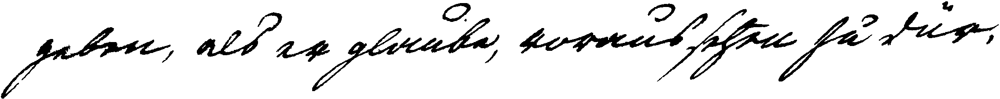

layout: true
  
<div class="my-header"></div>

<div class="my-footer">
  <table>
    <tr>
      <td style="text-align:right">Saxon State and University Library Dresden</td>
      <td></td>
      <td style="text-align:right"><a href="https://www.slub-dresden.de/">www.slub-dresden.de</a></td>
    </tr>
    <tr>
      <td style="text-align:right">OpenITI WS</td>
      <td>2020-01-29</td>
    </tr>
  </table>
</div>

<div class="my-title-footer">
  <table>
    <tr>
      <td style="text-align:left"><b>Kay-Michael Würzner</b></td>
    </tr>
    <tr>
      <td style="text-align:left">Research Software Engineer</td>
    </tr>
    <tr>
      <td style="font-size:8pt"><b>2020-01-29</b></td>
    </tr>
    <tr>
      <td style="font-size:8pt">Open Islamicate Texts Initiative Workshop</td>
    </tr>
  </table>
</div>

---

class: title-slide
count: false

# Multi-source OCR workflows with OCR-D
## Building blocks for superior digital text

---

# Overview

- OCR-D: The project and its philosophy
- `ocrd`: The toolkit and its design
- Notate bene
- Outlook and collaboration options

---

class: part-slide
count: false

# The project

---

# OCR-D: The project

- DFG-organized expert Workshop *Verfahren zur Verbesserung von OCR-Ergebnissen* (2014):
  > A concerted effort for improving OCR is required!
- Large-scale funding initiative
    + Targeting the *Verzeichnisse der im deutschen Sprachraum erschienenen Drucke* (VDs)
        * List of **all printed publications** issued in German or in the German language area
        * Sorted by centuries (VD16, VD17, VD18)
        * (Image digitization completed, approx. 460 000 volumes)
    + Coordinated and prepared by OCR-D
        * Herzog August Library Wolfenbüttel
        * Berlin State Library
        * Berlin-Brandenburg Academy of Sciences and Humanities
        * Karlsruhe Institute of Technology

---

# OCR-D: Timeline

- Stage 1 (2015--2017)
    + Identification of requirements
    + Setting up a call for participation
    + Planning a technical framework


---

# OCR-D: Timeline

- Stage 2 (2018--2020)
    + Implementing the technical framework
    + (Quasi-)Simultaneous operation of **eight module projects**
        * **Image optimization**: German Research Centre for Artificial Intelligence
        * **Layout analysis**: German Research Centre for Artificial Intelligence; University of Würzburg
        * **OCR Post correction**: University of Leipzig; Ludwig Maximilian University of Munich
        * **Font identification and OCR training**: Johannes Gutenberg University Mainz with Friedrich–Alexander University Erlangen–Nürnberg and University of Leipzig
        * **Improving Tesseract**: Mannheim University Library
        * **Long-term archiving**: Göttingen State and University Library
    + Early adoption in **nine different libraries**
        * Libraries of the coordination project partners
        * University and State Library Darmstadt
        * University and State Library Halle
        * Göttingen State and University Library
        * Mannheim University Library
        * Heidelberg University Library
        * Saxon State and University Library Dresden

---

# OCR-D: Timeline

- Hiatus (Final workshop in Bonn, 2020-02-12)
- Stage 3 (2020--2023, if approved)
    + Instanciation of the OCR-D software in libraries and archives
    + Development of usage models
        * Commercial providers of digitization services?
        * “Central” (public) digitization services?
        * Local infrastructure in each facility?
    + Development of productive workflows
        * Optimized tool chains for specific materials
        * OCR and OLR models
- Stage 4 (???)
    + Going productive, i.e. mass digitization of the VDs under comparable conditions
        
---

class: part-slide
count: false

# The toolkit

---

# `ocrd`: The toolkit

- Key concepts:
    * **Operation**: Step in an OCR workflow
    * **Processor**: Program which performs an operation
    * **Module**: Collection of processors
    * **Workspace**: Directory containing processor in- and output
- Collection of repositories: [github.com/OCR-D](https://github.com/OCR-D)
    1. Specifications
        + Formats
        + Interfaces
    2. API/CLI
        + Python- and BASH-based
        + Exposing formats and interfaces
        + Provides common utility functions (e.g. image rotation and cutting)
    3. Sample processors
        + Wrappers to OCR-related tools
- Developed and maintained by OCR-D

---

# `ocrd`: The toolkit

- Sample workflow
    1. Clone some [METS file](https://digital.slub-dresden.de/data/kitodo/adrefudio_20253082Z_1907/adrefudio_20253082Z_1907_mets.xml)
    ```sh
    $ ocrd workspace clone LINK_TO_METS .
    ```
    2. Identify the file group containing the images
    ```xml
    <mets:fileGrp USE="ORIGINAL">
     ...
    </mets:fileGrp>
    ```
    3. Apply desired processors
    ```sh
    $ ocrd-cis-ocropy-binarize -I ORIGINAL -O BIN -m mets.xml
    $ ocrd-tesserocr-segment-region -I BIN -O REGS -m mets.xml
    ```

---

# `ocrd`: The toolkit

- Formats
    * [METS XML](http://www.loc.gov/standards/mets/)
        + De-facto standard in (German) libraries
        + Represents a workspace, references files in the workspace
        + Contains **document-related** results (e.g., book structure)
    * [PAGE XML](https://github.com/PRImA-Research-Lab/PAGE-XML)
        + Mainly used in scientific competitions
        + Developed by [PRImA](https://www.primaresearch.org/)
        + More versatile than e.g. ALTO XML
    * [JSON](https://www.json.org/)
        + Used for parameter handover
    * [PNG](http://www.libpng.org/pub/png/)
        + Used to store intermediate results (i.e., `AlternativeImage`)
- ...

---

# `ocrd`: Available modules and processors

- [`ocrd_tesserocr`](https://github.com/OCR-D/ocrd_tesserocr): Wrappers for [Tesseract](https://github.com/tesseract-ocr/tesseract)
    + Use API via [`tesserocr`](https://github.com/sirfz/tesserocr)
    + Modular processors for
        * Binarization
        * Deskewing
        * Segmentation (region, line and word output)
        * Text recognition
- [`ocrd_cis_ocropy`](https://github.com/cisocrgroup/ocrd_cis): Wrappers for [OCRopy](https://github.com/tmbdev/ocropy)
    + Maintained by Robert Sachunsky (University of Leipzig)
    + Includes many bug fixes, optimizations and additions to original OCRopy
    + Modular processors for
        * Binarization
        * Image optimization (deskewing, denoising, dewarping)
        * Clipping (removal of region “intruders”)
        * Segmentation (region and line output)
        * Text recognition

---

# `ocrd`: Available modules and processors

- [`ocrd_olena`](https://github.com/OCR-D/ocrd_olena): Wrapper for [Olena/scribo](https://www.lrde.epita.fr/wiki/Olena/Modules#SCRIBO) binarization
    + Olena: OCR-D-like project in France
    + Many valuable tools
    + In particular, multiple locally adaptive binarization algorithms (e.g., [Wolf et al. 2002](https://hal.archives-ouvertes.fr/hal-02181880/document), [Lazzara and Géraud 2014](https://hal.archives-ouvertes.fr/hal-02181880/document))
- [`ocrd_anybaseocr`](https://github.com/mjenckel/ocrd_anybaseocr): Image preprocessing and layout analysis tool developed by the DFKI
    + Loosely based on OCRopus
    + Extended with data-driven tools for:
        * Dewarping
        * Text-image detection
        * Segmentation (region and line output)
        * Layout-semantic annotation

---

# `ocrd`: Available modules and processors

- [`ocrd_segment`](https://github.com/OCR-D/ocrd_segment): Worflow-relevant, segmentation-related processors
    + Rule-based post processing of segmentation results using [`shapely`](https://github.com/Toblerity/Shapely)
    + Evaluation of segmentation by GT comparison (WIP)
- [`ocrd_kraken`](https://github.com/OCR-D/ocrd_kraken): Wrappers for the [kraken OCR suite](http://kraken.re/)
    + However, not with the current development branch `blla`
- [`ocrd_calamari`](https://github.com/OCR-D/ocrd_calamari): Wrappers for the [Calamari OCR engine](https://github.com/Calamari-OCR/calamari)
- [`dinglehopper`](https://github.com/qurator-spk/dinglehopper): OCR evaluation tool developed by Qurator with an OCR-D interface
    + Uses text from multiple input file groups
    + CER/WER computation per page
- [`workflow-configuration`](https://github.com/bertsky/workflow-configuration): `make`-based combination of processors
    + Parallelization on document level
- [`ocrd_all`](https://github.com/OCR-D/ocrd_all): Master repository which includes most OCR-D repositories as submodules

---

# `ocrd`: A sound workflow

- Page level
    1. Binarize with
       `ocrd-olena_binarize -p '{"algo":"sauvola-ms-split"}'`
    2. Detect page border with
       `ocrd-anybaseocr-crop`
    3. Deskew with
       `ocrd-cis-ocropy-deskew -p '{"level-of-operation":"page"}'`
    4. Detect regions with
       `ocrd-esserocr-segment-region`

---

# `ocrd`: A sound workflow

- Region level
    1. Fix artifacts with
       `ocrd-segment-repair -p '{"plausibilize":"true"}'`
    2. Deskew with
       `ocrd-cis-ocropy-deskew -p '{"level-of-operation":"page"}'`
    3. Suppress region overlaps with
       `ocrd-cis-ocropy-clip`
    4. Detect lines with
       `ocrd-esserocr-segment-line`
    5. Tighten regions with
       `ocrd-segment-repair -p '{"sanitize":"true"}'`

---

# `ocrd`: A sound workflow

- Line level
    1. Suppress line overlaps with
       `ocrd-cis-ocropy-resegment`
    2. Dewarp with
       `ocrd-cis-ocropy-dewarp`
    3. Recognize text with
       `ocrd-tesserocr-recognize -p '{"model":"Latin+Japanese"}'`


```
レコ ー ド で は EMI、 カ プリ ッ ツ ィ オ 、 徳間 な どの レー ヴェ ル で
```

---

class: part-slide
count: false

# Notate bene

---

# NB 1: Binarization

.cols[
.fifty[
<center>

</center>
<p style="font-size:1.4rem">
Zuletzt wird anders nichts dara<span style="color:red">n</span>s/<br/>
Di<span style="color:red">r</span> <span style="color:red">z</span>acke<span style="color:red">1</span> dieſer Erden <span style="color:red">r ’’</span><br/>
Die Sonne/Kind<span style="color:red">r</span>r/Fre<span style="color:red">nu</span>d’ vnd Hauß<br/>
Muß übergeben werden/ <span style="color:red">’’</span><br/>
Denn di<span style="color:red">r</span>Nat<span style="color:red">n</span>r erläſſt vns<span style="color:red">’ mehr ’</span><br/>
Der ſtre<span style="color:red">u</span>genSch<span style="color:red">n</span>ld <span style="color:red">o</span>ndPflich<span style="color:red">r</span>.
</p>
]
.fifty[
<center>

</center>
<p style="font-size:1.4rem">
Zuletzt wird anders nichts dara<span style="color:red">n</span>s/<br/>
Die Fackel dieſer Erden<br/>
Die Sonne/Kinder/Fren<span style="color:red">n</span>nd’ vnd Hauß<br/>
Muß übergeben werden/<br/>
Denn de<span style="color:red">e</span>Na<span style="color:red">in</span>r erläſſt vns nicht<br/>
Der ſtrengen Schuld vndPflicht.
</p>
]
]

- Same engine, same model, different binarization
- Most existing OCR models were trained on B/W.
- Generated images will most likely be B/W. 

---

# NB 2: Image preprocessing

.cols[
.fifty[
- Often called “superfluous”
  > Just feed the neural network what you got
- High variance in historical digitals
    + Decay of source materials
    + Microfiche
    + Image-text mix
- Common ground through image preprocessing
    + Reuse existing models
    + Reuse existing software
]
.fifty[
<center>

</center>
]
]

---

# NB 3: Training Tesseract

- Tesseract's [model stack](https://github.com/tesseract-ocr/tessdata_best)
    + Trained on **synthetic materials**
        * Web text
        * Many, many fonts
        * Rendered as image
    + Great number of existing models
    + Very robust but often not “great”
- [Training tools](https://github.com/tesseract-ocr/tesstrain) for Tesseract
    + Allows training with **real images**
    + Allows **fine tuning** of existing models
    + Comfortable invocation via `make`
- In combination with the workflow sketched above:

- **Handwritten text recognition** with Tesseract is possible!  

---

count: false

# NB 3: Training Tesseract

- Tesseract's [model stack](https://github.com/tesseract-ocr/tessdata_best)
    + Trained on **synthetic materials**
        * Web text
        * Many, many fonts
        * Rendered as image
    + Great number of existing models
    + Very robust but often not “great”
- [Training tools](https://github.com/tesseract-ocr/tesstrain) for Tesseract
    + Allows training with **real images**
    + Allows **fine tuning** of existing models
    + Comfortable invocation via `make`
- In combination with the workflow sketched above:

- **Handwritten text recognition** with Tesseract is possible!  

---

class: part-slide
count: false

# Outlook and collaboration options

---

# Outlook and collaboration options

- Text recognition is a solved problem.
- Segmentation into lines is a solved problem.
- **Segmentation into regions is an open problem.**

- Final workshop and evaluation by DFG in February
- Further maintenance of the OCR-D software stack by SBB, Uni Leipzig and SLUB
- Existing collaboration with [OCR4all](https://github.com/OCR4all) and [Qurator](https://qurator.ai/)
- We are open for suggestions and we're ready to make your tools OCR-D-fit!

---

class: part-slide

# Many thanks for your attention!

<center>
<a href="https://wrznr.github.io/OpenITI-2020/">wrznr.github.io/OpenITI-2020</a>
</center>
